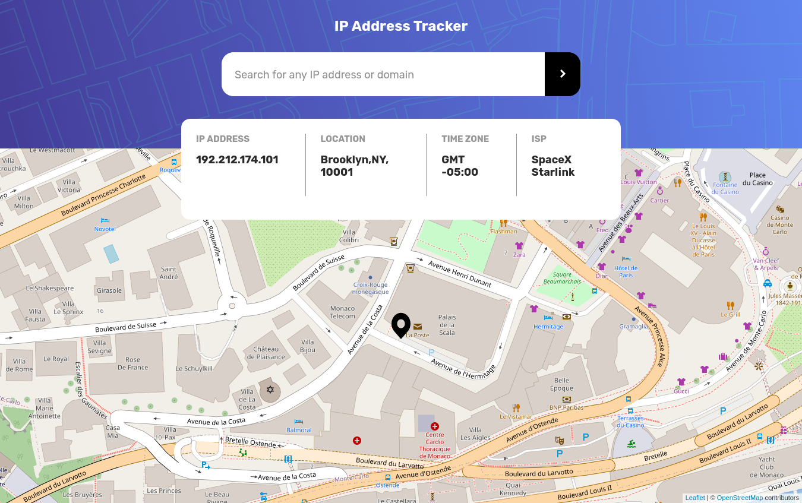

# Frontend Mentor - IP address tracker solution

This is a solution to the [IP address tracker challenge on Frontend Mentor](https://www.frontendmentor.io/challenges/ip-address-tracker-I8-0yYAH0). Frontend Mentor challenges help you improve your coding skills by building realistic projects. 

## Table of contents

- [Overview](#overview)
  - [The challenge](#the-challenge)
  - [Screenshot](#screenshot)
  - [Links](#links)
- [My process](#my-process)
  - [Built with](#built-with)
- [Author](#author)

## Overview

### The challenge

Users should be able to:

- View the optimal layout for each page depending on their device's screen size
- See hover states for all interactive elements on the page
- See their own IP address on the map on the initial page load
- Search for any IP addresses or domains and see the key information and location

### Screenshot

### Links

- Solution URL: [Solution URL](https://www.frontendmentor.io/solutions/ip-address-tracker-using-reactjs-xMoJquz8A)
- Live Site URL: [https://ip-address-tracker-react-teal.vercel.app/](https://ip-address-tracker-react-teal.vercel.app/)

## My process

### Built with

- Semantic HTML5 markup
- CSS custom properties
- Flexbox
- [React](https://reactjs.org/) - JS library

## Author

- Website - [Vivek K J](https://www.vivekkj.com)
- Frontend Mentor - [@vivekkj123](https://www.frontendmentor.io/profile/vivekkj123)
- Twitter - [@iamvivekkj](https://www.twitter.com/iamvivekkj)

